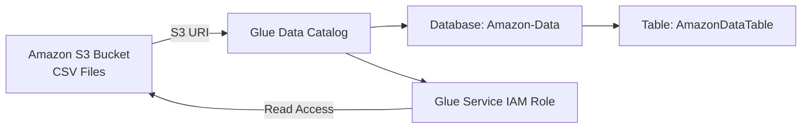

# AWS Glue Data Catalog Hands-On Lab

## Objective

In this lab, you will:

- Create an Amazon S3 bucket
- Upload CSV source data
- Configure AWS Glue IAM permissions
- Create a Glue database
- Create a Glue table referencing S3 data

---

# Architecture Overview

This lab demonstrates how AWS Glue Data Catalog references structured data stored in Amazon S3.

## Architecture Diagram (ASCII)

```
+--------------------------------------------------------+
|                     AWS Account                        |
|                                                        |
|  +------------------+                                  |
|  |   Amazon S3      |                                  |
|  |------------------|                                  |
|  |  Bucket:         |                                  |
|  |  dea-course-*    |                                  |
|  |                  |                                  |
|  |  /amazon-data/   |                                  |
|  |     *.csv files  |                                  |
|  +--------+---------+                                  |
|           |                                            |
|           | S3 URI (s3://bucket/amazon-data/)         |
|           v                                            |
|  +--------------------------+                          |
|  |   AWS Glue Data Catalog  |                          |
|  |--------------------------|                          |
|  |  Database: Amazon-Data   |                          |
|  |  Table: AmazonDataTable  |                          |
|  +------------+-------------+                          |
|               |                                        |
|               | Uses IAM Role                          |
|               v                                        |
|  +--------------------------+                          |
|  | Glue Service IAM Role    |                          |
|  | - Read-only access to S3 |                          |
|  +--------------------------+                          |
|                                                        |
+--------------------------------------------------------+
```

---

## Mermaid Diagram (If Supported by Markdown Viewer)



---

# Step 1: Create an S3 Bucket

1. Log in to the AWS Management Console.
2. Navigate to **Amazon S3**.
3. Click **Create bucket**.
4. Enter a globally unique bucket name.

   Example:
   ```
   dea-course-yourname-12345
   ```

5. Leave all settings as default.
6. Click **Create bucket**.

---

# Step 2: Upload Data to the Bucket

1. Open the newly created bucket.
2. Click **Upload**.
3. Click **Add folder**.
4. Select the **Amazon data folder** from your course downloads.
5. Click **Upload** at the bottom of the page.
6. Wait for the upload to complete.

Your CSV data is now stored in S3.

---

# Step 3: Copy the S3 URI

1. Navigate into the uploaded folder.
2. Go to the **Properties** tab.
3. Copy the **S3 URI**.

Example:
```
s3://dea-course-yourname-12345/amazon-data/
```

You will use this URI when creating the Glue table.

---

# Step 4: Configure AWS Glue IAM Permissions

1. Navigate to **AWS Glue** in the console.
2. Click **Set up roles and users**.
3. Click **Next**.
4. Click **Next** again.
5. Ensure the standard Glue service role is selected.
6. Click **Next**.
7. Enable **Grant Amazon S3 Access**.
8. Choose **Add access to specific locations**.
9. Select your S3 bucket.
10. Click **Confirm**.
11. Leave permission as **Read-only**.
12. Click **Next**.
13. Click **Next** again.
14. Click **Apply changes**.

The Glue service role now has permission to read your S3 data.

---

# Step 5: Create a Glue Database

1. In AWS Glue, click **Databases**.
2. Click **Add database**.
3. Enter:

   ```
   Amazon-Data
   ```

4. Click **Create database**.

---

# Step 6: Create a Table in Glue Data Catalog

1. Click on the `amazon-data` database.
2. Click **Add table**.
3. Enter the table name:

   ```
   AmazonDataTable
   ```

4. Under **Data location**, paste the S3 URI.
5. For **Data format**, select:

   ```
   CSV
   ```

6. Leave other settings as default.
7. Click **Next**.
8. Click **Next** again.
9. Click **Create**.

---

# Result

You have successfully:

- Created an S3 bucket
- Uploaded CSV data
- Configured Glue IAM permissions
- Created a Glue database
- Created a Glue table referencing S3 data

The Glue Data Catalog now stores metadata pointing to your S3 data.

---

# Key Concept

The Glue Data Catalog does **not store data**.

It stores:

- Table schema
- Data format
- S3 location
- Database structure

The actual data remains in Amazon S3.

---

# Next Steps

You can now:

- Use a **Glue Crawler** to automatically detect schema
- Query the data using **Amazon Athena**
- Build ETL jobs in AWS Glue
- Integrate with Lake Formation for governance

## Querying Data with Amazon Athena

To query the data using Athena, you need to set up a query result location.

### Step 1: Create an S3 Bucket for Query Results

1. Log in to the AWS Management Console.
2. Navigate to **Amazon S3**.
3. Click **Create bucket**.
4. Enter a globally unique bucket name, e.g., `dea-course-results-yourname-12345`.
5. Leave all settings as default.
6. Click **Create bucket**.

### Step 2: Configure Athena Workgroup

1. Navigate to **Amazon Athena** in the console.
2. Click **Workgroups** in the left menu.
3. Select your workgroup (default is `primary`).
4. Click **Edit**.
5. Under **Query result location**, enter the S3 URI of the bucket you created, e.g., `s3://dea-course-results-yourname-12345/results/`.
6. Click **Save changes**.

Now you can run queries in Athena without the output location error.

---

flowchart LR
    A[Amazon S3 Bucket<br>CSV Files] -->|S3 URI| B[Glue Data Catalog]
    B --> C[Database: Amazon-Data]
    C --> D[Table: AmazonDataTable]
    B --> E[Glue Service IAM Role]
    E -->|Read Access| A

