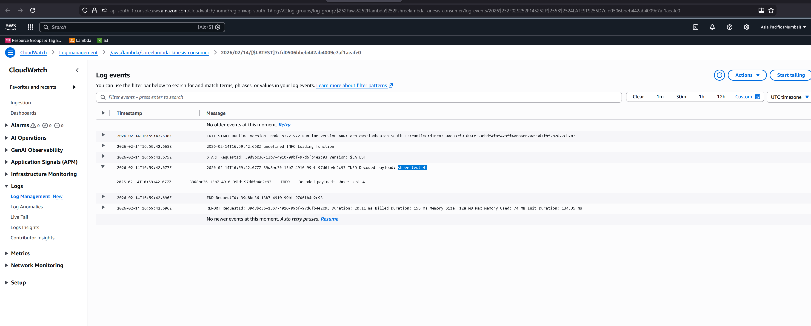

# Kinesis Stream to Lambda (Node.js) – Step-by-Step

## Goal
Create a Kinesis Data Stream, attach the Lambda blueprint **Process records sent to Kinesis stream (Node.js)** with a new IAM role, and test with a sample `put-record` call.

## Prereqs
- AWS account with permissions for Kinesis, Lambda, IAM
- AWS CLI configured (`aws configure`)

## 1) Create the Kinesis Data Stream (Console)
1. Open **AWS Console** → **Kinesis** → **Data streams** → **Create data stream**.
2. Name: `demo-kinesis-stream` (or your choice).
3. Capacity mode: **On-demand** (simple) or **Provisioned** if you need fixed shards.
4. Click **Create data stream** and wait for **Active** status.

### (Optional) CLI equivalent
```bash
aws kinesis create-stream \
	--stream-name demo-kinesis-stream \
	--stream-mode-details StreamMode=ON_DEMAND
```

## 2) Create the Lambda from the Blueprint
1. Open **AWS Console** → **Lambda** → **Create function**.
2. Choose **Use a blueprint**.
3. Search and select blueprint: **Process records sent to Kinesis stream** (Node.js runtime, typically Node.js 18+).
4. Function name: `demo-kinesis-consumer`.
5. **Change default execution role** → **Create a new role with basic Lambda permissions** (name example: `demo-kinesis-consumer-role`).
6. Under **Kinesis trigger**, pick the stream `demo-kinesis-stream`.
7. Keep default batch size/starting position unless you need custom settings.
8. Click **Create function**. The trigger and permission will be added automatically.

### Notes on IAM
- The new role gets `AWSLambdaBasicExecutionRole` for CloudWatch Logs.
- also add "AWSLambdaKinesisExecutionRole" for kinesis
- The trigger adds a resource-based policy so Kinesis can invoke Lambda.

## 3) Review/Adjust the Lambda Code
- The blueprint already parses base64-encoded records and logs payloads. You can customize inside the generated `index.mjs`/`index.js` as needed.

## 4) Test by Sending Records to Kinesis
Use AWS CLI from a shell that has credentials pointing to the same account/region.

```bash
# AWS CloudShell (Mumbai); adjust if you are in a different region.
REGION=ap-south-1
STREAM=shree-test

aws kinesis put-record --region "$REGION" --stream-name "$STREAM" --partition-key "pk-1" --data c2hyZWUgdGVzdCA0 (base 64 generated text)
```

## 5) Verify Lambda Invocation
1. In **Lambda → Monitor → Logs**, open the latest log stream.
2. You should see decoded records similar to `shree test 4 `.


## 6) Clean Up
1. Delete the Lambda function: **Lambda → Functions → demo-kinesis-consumer → Actions → Delete**.
2. Delete the event source mapping if it still exists (Triggers tab).
3. Delete the stream: **Kinesis → Data streams → demo-kinesis-stream → Delete**.
4. Delete the IAM role if no longer needed: **IAM → Roles → demo-kinesis-consumer-role → Delete**.

