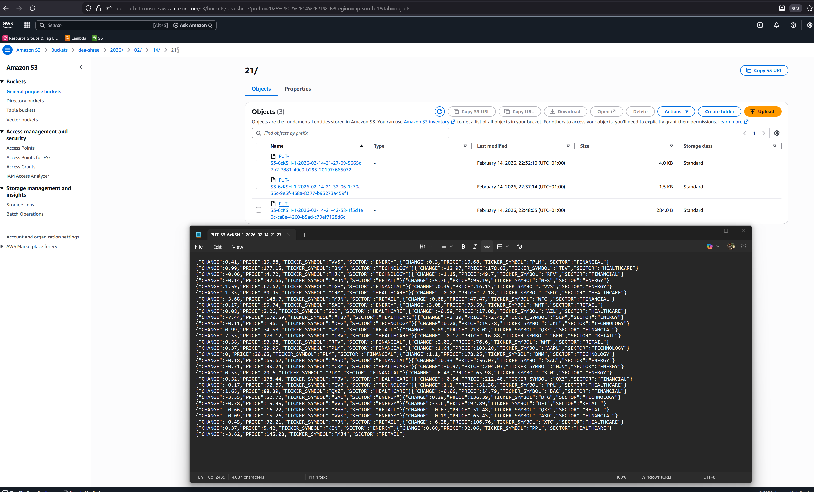

# Amazon Data Firehose Practical - Direct PUT to S3

## Goal
- Send records directly to Kinesis Data Firehose.
- Deliver to S3 bucket arn:aws:s3:::dea-shree.

## Prerequisites
- AWS account with permissions for Firehose, S3, IAM.
- S3 bucket already created: dea-shree.
- AWS CLI configured with access keys and default region.

## Step 1: Create Firehose Delivery Stream
- Delivery stream name: dea-firehose-direct-put.
- Source: Direct PUT.
- Destination: Amazon S3.
- S3 bucket: dea-shree.
- Prefix: firehose/!{timestamp:yyyy}/!{timestamp:MM}/!{timestamp:dd}/
- Error prefix: firehose-error/!{firehose:error-output-type}/
- Buffering: 5 MB or 300 seconds.
- Compression: GZIP.
- IAM role: use the role from Step 1.

## Step 2: Put Records to Firehose
- Single record example:
  - Use PutRecord with a JSON line payload.
- Batch record example:
  - Use PutRecordBatch for multiple records.

## Step 3: Verify in S3
- Open S3 bucket dea-shree.
- Confirm objects under prefix firehose/yyyy/mm/dd/.
- Download and decompress GZIP objects.
- Validate JSON lines content.

## CLI Examples

You can directly send test data using firehose in aws console.

## Common Pitfalls
- Missing IAM role or incorrect trust policy.
- Region mismatch between CLI and Firehose.
- Data payload must be base64-safe; CLI handles this.
- Buffering delays are expected before S3 objects appear.

## Quick Cleanup
- Delete delivery stream if no longer needed.
- Remove test objects from S3 if required.

## Amazon Data Firehose - Last Minute Notes
- Fully managed delivery service; no consumer code needed.
- Sources: Direct PUT, Kinesis Data Streams, or MSK (as configured).
- Destinations: S3, Redshift (via S3), OpenSearch, Splunk, HTTP endpoint.
- Buffers by size/time; expect delivery delay based on settings.
- Automatic scaling; you do not manage shards.
- Supports data transformation with Lambda before delivery.
- Supports record format conversion to Parquet/ORC using Glue Data Catalog.
- Error output goes to S3 with the error prefix for troubleshooting.
- Use compression (GZIP/ZIP/Snappy) to reduce storage and scan costs.
- Encryption: S3 SSE-S3 or SSE-KMS; in transit via TLS.
- Retry behavior: Firehose retries transient failures before writing to S3 error prefix.
- Common exam hint: Firehose for managed delivery; Streams for custom consumers.
